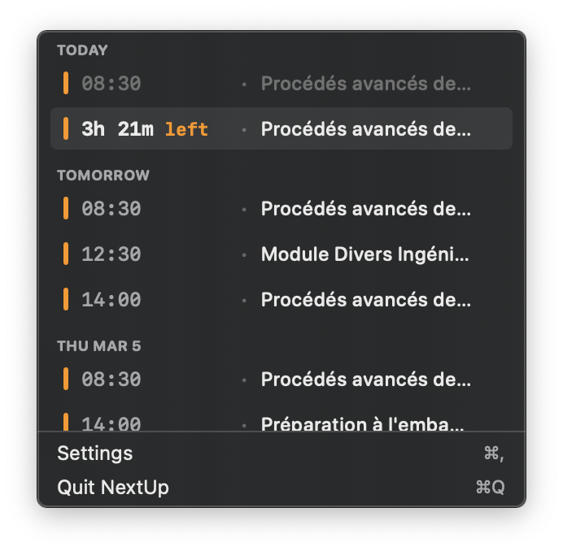
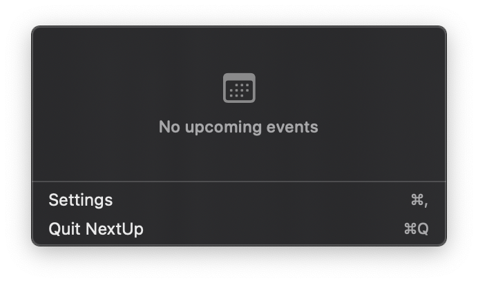

# NextUp

NextUp is a native macOS menu bar calendar companion designed around a clean, Notion Calendar-inspired aesthetic: compact typography, clear time hierarchy, and immediate context for what is happening now and what is next.

The app stays in the menu bar, keeps your upcoming schedule visible at a glance, and opens events directly in Apple Calendar when needed.

## Key Features

- **Live countdown for active events**: displays remaining time (for example, `18m left`) and updates every minute.
- **Dynamic menu bar title**: shows either the current event or the upcoming event depending on user preference.
- **Calendar filtering**: enable or disable individual calendars from settings without changing Apple Calendar itself.
- **Fast grouped popover**: events are grouped by day (`TODAY`, `TOMORROW`, and date sections).
- **Menu bar customization**: control icon visibility and character limit for compact titles.

## Screenshots

### Main View



### Empty State



## Installation

### Option 1: Download a Release

1. Open the [Releases](https://github.com/Broky64/NextUp/releases) page.
2. Download the latest packaged build.
3. Move `NextUp.app` to `/Applications`.
4. Launch the app and grant Calendar permission when prompted.

### Option 2: Build from Source

1. Clone the repository:
   ```bash
   git clone https://github.com/Broky64/NextUp.git
   cd NextUp
   ```
2. Open `NextUp.xcodeproj` in Xcode.
3. Select the `NextUp` scheme.
4. Build and run (`⌘R`).
5. Grant Calendar permission in macOS when requested.

## Privacy

NextUp is privacy-first by design:

- Calendar data is accessed through Apple's `EventKit` framework.
- Event data is processed locally on your Mac.
- No analytics, tracking, or remote event synchronization is built into the app.
- User preferences are stored locally in `UserDefaults`.

This local-only model aligns well with GDPR and general privacy-by-default principles.

## Contributing

Contributions are welcome.

- Open a bug report or feature request in [GitHub Issues](https://github.com/Broky64/NextUp/issues).
- Submit improvements through a pull request from your fork.
- Read [CONTRIBUTING.md](CONTRIBUTING.md) before opening a PR.

## Security

If you discover a vulnerability, please follow [SECURITY.md](SECURITY.md) for responsible disclosure.

## License

NextUp is released under the [GNU GPL v3](LICENSE).
